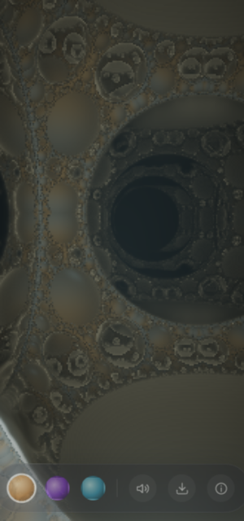

# PORTAL — a window into another dimension

**A gyro-anchored raymarched fractal world, in one self-contained HTML file.**
No libraries. No build step. No network calls.

**▶ Try it live: [trusch.github.io/portal](https://trusch.github.io/portal/)** — best on a phone, sound on.

<p align="center">
  
  <br>
  <em>Preview rendered on a software rasterizer at reduced resolution — a real phone GPU does far better, in motion, anchored to your room.</em>
</p>

## What it does

Your phone becomes a magic lens. On the other side of the glass stands an infinite Apollonian fractal — a foam cathedral with no walls and no end — and it is **anchored to real space through your gyroscope**. Turn around, look up, sweep the phone across your room: the dimension stays put, as if it had been standing behind reality all along.

| Gesture | Effect |
|---|---|
| **Move the phone** | Look around — the world is fixed to real space |
| **Hold a finger** on the glass | Glide forward into the structure (collision-aware) |
| **Double-tap** | Send a pulse of light rippling through the dimension |
| **Drag** | Look around manually (fallback without a gyroscope) |

Three dimensions to step between: **Sanctum** (gold), **Void Bloom** (violet), **Hyperglass** (ice) — each a different fold constant and palette of the same field.

## Under the hood

Everything lives in [`index.html`](index.html):

- **The world** — a fragment shader raymarches an Apollonian sphere-packing distance field (8 fold iterations, up to 90 march steps) with orbit-trap coloring, emissive veins, accumulated atmosphere glow, distance fog, specular key light and a traveling pulse shell. Tone-mapped with an S-curve contrast pass.
- **The camera** — `deviceorientation` Euler angles become a quaternion (intrinsic Y·X·Z composition, screen-rotation corrected, remapped so the camera looks out of the back of the phone), smoothed by hemisphere-corrected nlerp. Drag-look composes on top; desktops get an idle drift.
- **The physics** — the same distance field is duplicated in JavaScript and used for two things the shader can't do: finding an open-air spawn point (3D scan for the largest free radius) and collision-aware gliding.
- **The sound** — a cavernous drone, distance bells on a pentatonic row, wind that rises as you glide, and a sub-bass drop on every pulse; all raw oscillators and shaped noise through a runtime-generated 4.5s convolution reverb. Includes the mobile AudioContext unlock dance (resume + silent-buffer kick on gesture-end events).
- **Performance** — internal render scale adapts between 0.32× and 0.8× of device resolution to hold frame time, measured by EMA.

## Run it

```sh
# open directly
open index.html

# or serve it for your phone
python3 -m http.server 8080 --bind 0.0.0.0
```

iOS asks for motion-sensor permission on first touch — that's the gyro anchor.

## The origin story

Part of a series of single-prompt AI showcase apps. The challenge:

> "I want to test your capabilities. Create a mobile first webapp that shows what you are capable of and will blow not just my mind but anybody's mind. It should get millions of views if I posted a short video of it. This level of awesome. It should be a self contained webapp."

The first answer was [FLUX](https://github.com/trusch/flux). PORTAL was idea #1 on the follow-up shortlist ("Build 1 and 2 independently as their own projects!"). Designed, written, and verified — headless-browser render probes included — by **Claude** (Anthropic's `claude-fable-5` model, running as Claude Code).

The Apollonian distance field follows Inigo Quilez's classic formulation.

## License

[MIT](LICENSE)
